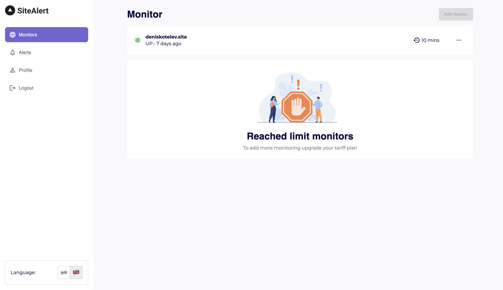

## 🚀 Alet-main - monitoring app

<p align="center">
  
</p>

## Basic Overview
<p>
 <div>
    This is a simple website monitoring app built with React, Typescript, MUI5
 </div>
  <div>
    Backend repository https://github.com/hardsmile98/alert-backend
 </div>
</p>

### Requirements

- Node.js
- Yarn

```javascript
/* First, Install the needed packages */
yarn

/* Then start the React app */
yarn dev:web

/* To run app with mock server */
yarn dev
```
